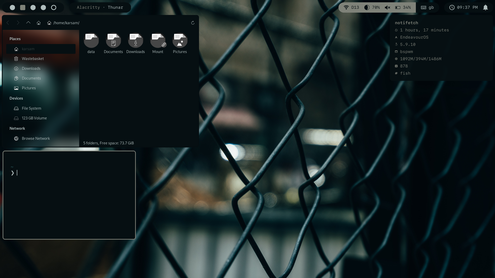

# dotfiles

My dotfiles repo

## BSPWM

* distro: endeavour os
* wm: bspwm
* keybinds: sxhkd
* bar: polybar
* notifications: dunst
* menu: rofi
* terminal: alacritty
* gtk: phocus

## Requirements

* bspwm-git
* sxhkd-git
* thunar-git
* polybar-git
* picom-ibhagwan-git
* otf-sfmono
* otf-san-francisco
* nerd-fonts-sf-mono
* alacritty
* maim

Dirs:

~
  .config/
    polybar
    bspwm
    sxhkd
    dunst
    picom
    rofi
    startpage
    alacritty.yml
  .mozilla/
    firefox/
      chrome
  .themes
    phocus
