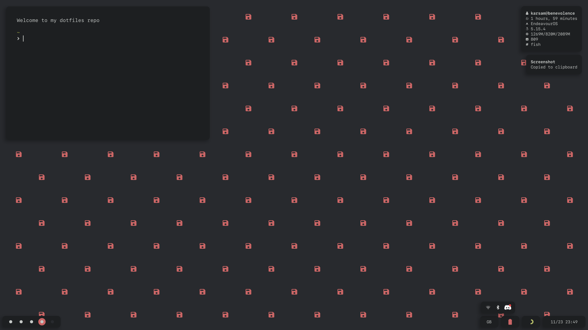

# dotfiles


<p align="center">
  
</p>

## awesome

* distro: endeavour os
* wm: awsome
* keybinds: awesome.awful
* bar: awesome.wibox
* notifications: awesome.naughty
* menu: rofi
* file manager: thunar
* terminal: alacritty
* lockscreen: betterlockscreen
* gtk: 
* startpage: 

## required packages

* awesome-git
* thunar-git
* rofi
* picom-ibhagwan-git
* otf-sfmono
* otf-san-francisco
* nerd-fonts-sf-mono
* alacritty
* maim
* xclip
* betterlockscreen

## dirs
```
~
  .config/
    awesome
    picom
    rofi
    termstart
    phocus-gtk
    alacritty
    discocss
    scripts
    zathura
  .mozilla/
    firefox/
      *.default-release/
        chrome
```
